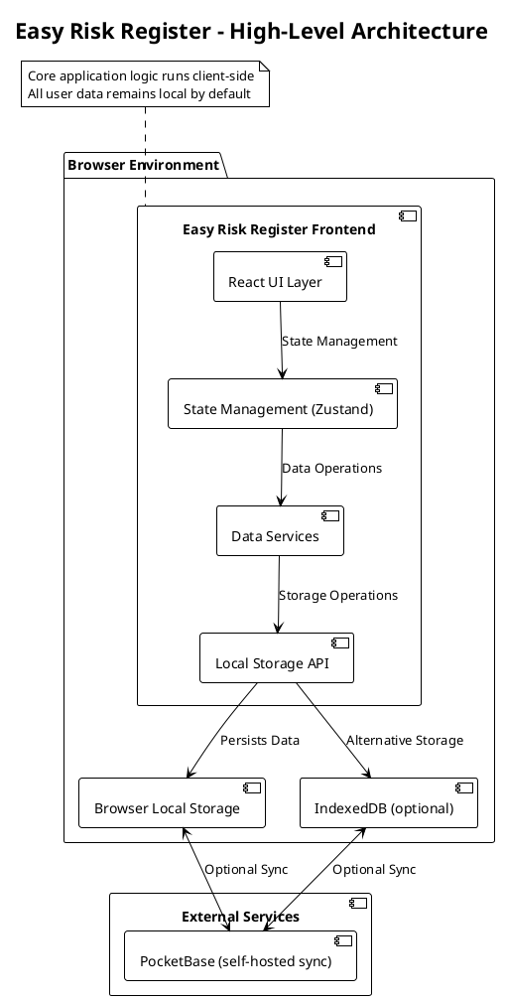
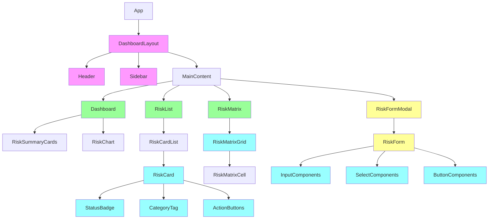
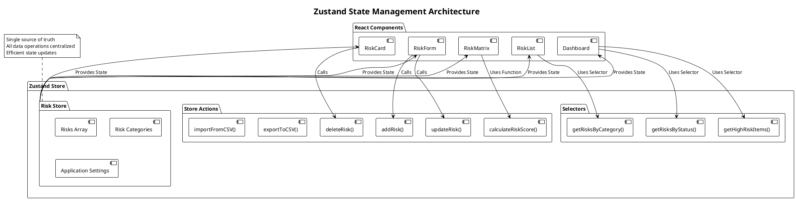
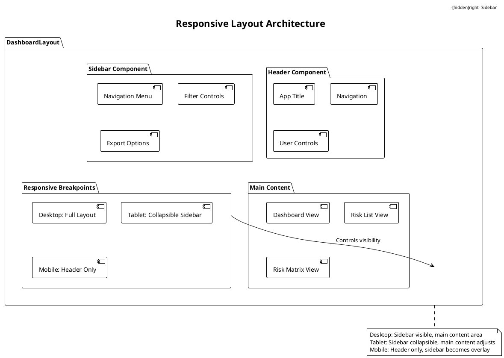
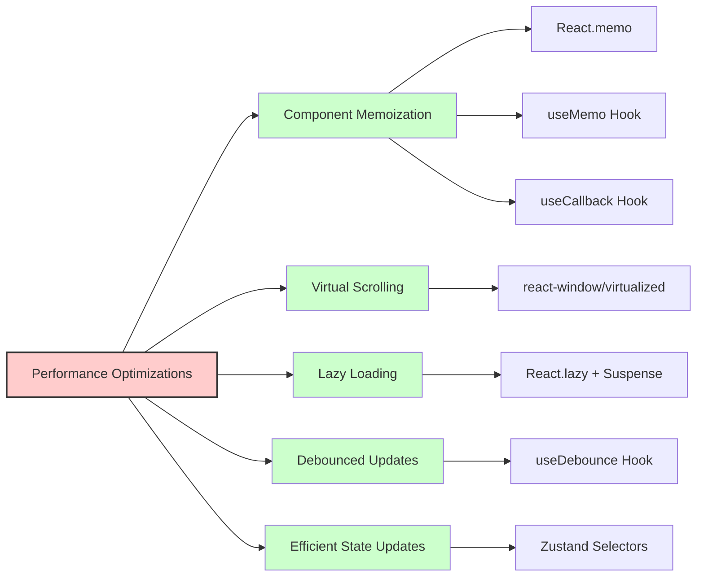
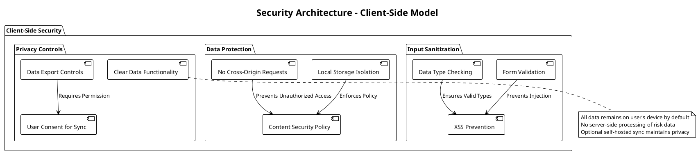
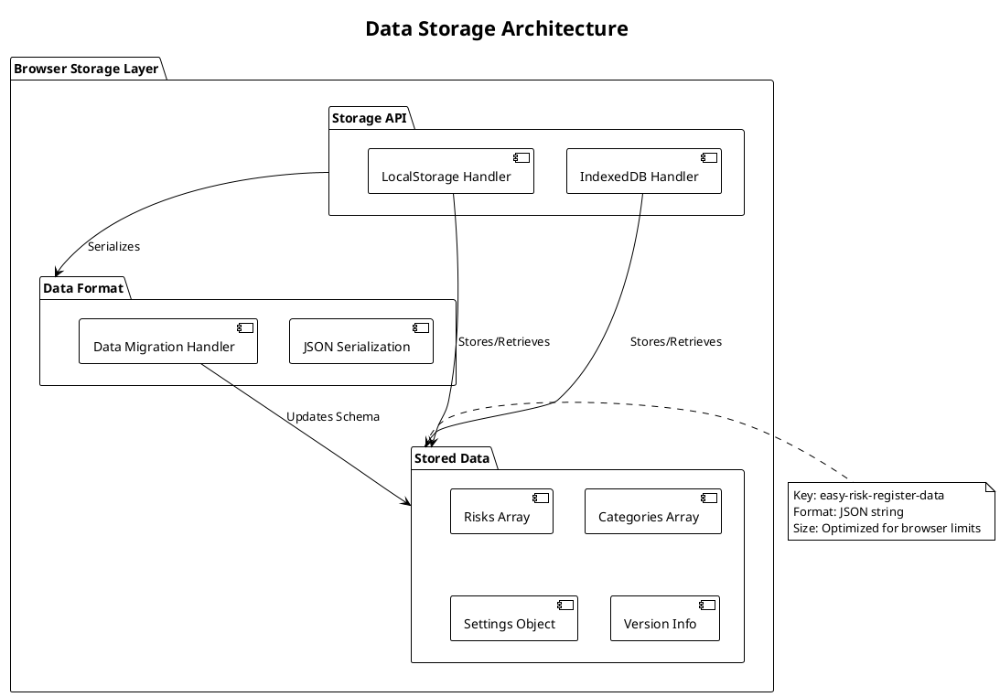
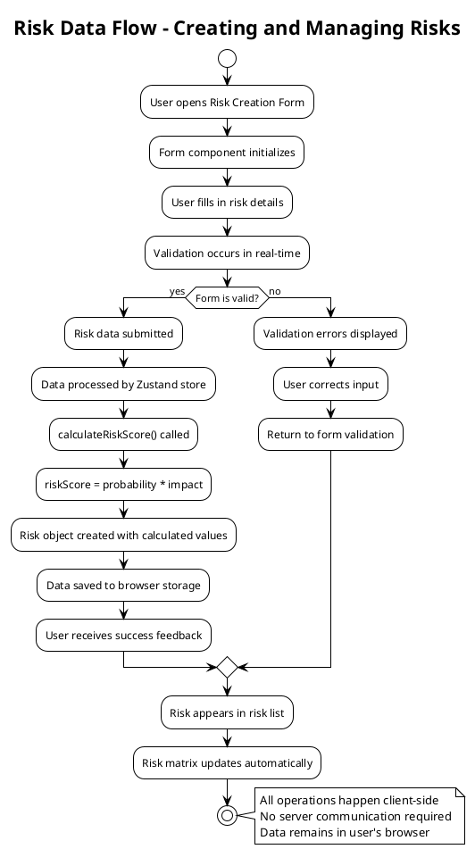

# System Architecture for Easy Risk Register

Based on the product requirements and tech stack preferences, I've developed a comprehensive system architecture for the Easy Risk Register application. This document serves as the technical blueprint for implementation teams.

## Executive Summary

The Easy Risk Register is designed as a privacy-focused, client-side risk management application that operates entirely in the browser. The architecture emphasizes data privacy, performance, and usability while maintaining a clean separation of concerns for maintainability and future extensibility.

### High-Level Architecture Diagram



### Technology Stack Summary

**Frontend:**
- Core: React (via Vite) + TypeScript
- State Management: Zustand
- Forms: React Hook Form
- Styling: Tailwind CSS
- Animation: Framer Motion
- UI Components: NativeBase with web support
- Routing: React Router

**Data Management:**
- Primary Storage: Browser LocalStorage/IndexedDB
- Optional Cloud Sync: PocketBase (self-hosted)

**Development & Build:**
- Build Tool: Vite
- Testing: Jest
- Type Safety: TypeScript
- PWA Support: Service Workers

## For Frontend Engineers

### Component Architecture

#### Component Hierarchy Diagram



#### Core Component Structure
```
src/
├── components/
│   ├── ui/                 # Reusable UI components
│   │   ├── Button.tsx
│   │   ├── Input.tsx
│   │   ├── Modal.tsx
│   │   └── ...
│   ├── risk/              # Risk-specific components
│   │   ├── RiskForm.tsx
│   │   ├── RiskCard.tsx
│   │   ├── RiskMatrix.tsx
│   │   └── ...
│   ├── layout/            # Layout components
│   │   ├── Header.tsx
│   │   ├── Sidebar.tsx
│   │   └── DashboardLayout.tsx
│   └── common/            # Shared utility components
├── pages/                 # Page components
│   ├── Dashboard.tsx
│   ├── RiskList.tsx
│   ├── RiskCreate.tsx
│   └── Settings.tsx
├── hooks/                 # Custom React hooks
│   ├── useLocalStorage.ts
│   ├── useForm.ts
│   └── useRiskCalculations.ts
├── stores/                # Zustand stores
│   └── riskStore.ts
├── types/                 # TypeScript type definitions
│   └── index.ts
└── utils/                 # Utility functions
    ├── calculations.ts
    ├── exports.ts
    └── validators.ts
```

#### State Management Architecture



#### State Management (Zustand Store)

```typescript
// src/stores/riskStore.ts
interface Risk {
  id: string;
  title: string;
  description: string;
  probability: number; // 1-5 scale
  impact: number;      // 1-5 scale
  riskScore: number;   // probability * impact
  category: string;
  status: 'open' | 'mitigated' | 'closed';
  mitigationPlan: string;
  creationDate: Date;
  lastModified: Date;
}

interface RiskStore {
  risks: Risk[];
  categories: string[];
  addRisk: (risk: Omit<Risk, 'id' | 'riskScore' | 'creationDate' | 'lastModified'>) => void;
  updateRisk: (id: string, updates: Partial<Risk>) => void;
  deleteRisk: (id: string) => void;
  exportToCSV: () => string;
  importFromCSV: (csv: string) => void;
  calculateRiskScore: (probability: number, impact: number) => number;
}
```

### API Integration Patterns

Since this is a client-side application, data interactions will be with browser storage:

```typescript
// src/hooks/useLocalStorage.ts
const useLocalStorage = <T>(key: string, initialValue: T) => {
  const [storedValue, setStoredValue] = useState<T>(() => {
    try {
      const item = window.localStorage.getItem(key);
      return item ? JSON.parse(item) : initialValue;
    } catch (error) {
      console.error(`Error reading localStorage key "${key}":`, error);
      return initialValue;
    }
  });

  const setValue = (value: T | ((val: T) => T)) => {
    try {
      const valueToStore = value instanceof Function ? value(storedValue) : value;
      setStoredValue(valueToStore);
      window.localStorage.setItem(key, JSON.stringify(valueToStore));
    } catch (error) {
      console.error(`Error setting localStorage key "${key}":`, error);
    }
  };

  return [storedValue, setValue] as const;
};
```

### Form Architecture (React Hook Form)

```typescript
// src/components/risk/RiskForm.tsx
interface RiskFormData {
  title: string;
  description: string;
  probability: number;
  impact: number;
  category: string;
  mitigationPlan: string;
}

const RiskForm: React.FC<{ onSubmit: (data: RiskFormData) => void; initialData?: RiskFormData }> = ({ onSubmit, initialData }) => {
  const { register, handleSubmit, formState: { errors }, setValue } = useForm<RiskFormData>({
    defaultValues: initialData || {
      title: '',
      description: '',
      probability: 1,
      impact: 1,
      category: 'Operational',
      mitigationPlan: ''
    }
  });

  return (
    <form onSubmit={handleSubmit(onSubmit)}>
      {/* Form fields with validation */}
    </form>
  );
};
```

### Responsive Design Strategy

#### Responsive Layout Architecture



The application will use Tailwind CSS for responsive design:

```typescript
// Responsive breakpoints
// sm: 640px, md: 768px, lg: 1024px, xl: 1280px, 2xl: 1536px

const DashboardLayout = () => (
  <div className="flex flex-col md:flex-row h-screen">
    <aside className="md:w-64 bg-gray-100 p-4 hidden md:block"> {/* Desktop sidebar */ }</aside>
    <main className="flex-1 p-4 overflow-auto"> {/* Main content */ }</main>
  </div>
);
```

### Performance Optimization Strategies

- Lazy loading for components not immediately visible
- Memoization for expensive calculations using React.memo and useMemo
- Debounced updates for risk matrix visualization
- Efficient state updates to prevent unnecessary re-renders

#### Performance Architecture



## For QA Engineers

### Testable Component Boundaries

#### Unit Testing Strategy
- Risk calculation functions: `calculateRiskScore(probability, impact)` - calculates probability × impact (5x5 matrix, scores 1-25)
- Risk severity functions: `getRiskSeverity(score)` - determines Low (≤3), Medium (≤6), High (>6)
- Form validation logic: Input sanitization and validation
- Export functionality: CSV generation and data integrity
- State management: Store updates and persistence

#### Integration Testing Points
- Form submission and data persistence flow
- Risk matrix visualization updates with data changes
- CSV import/export roundtrip validation
- LocalStorage data consistency

### Data Validation Requirements

#### Input Validation
- Risk title: Required, max 200 characters
- Risk description: Optional, max 1000 characters
- Probability: Required, numeric 1-5
- Impact: Required, numeric 1-5
- Category: Required from predefined list
- Mitigation plan: Optional, max 2000 characters

#### Data Integrity Checks
- Risk scores correctly calculated as probability × impact (range 1-25 for 5x5 matrix)
- Risk severity correctly determined: Low (≤3), Medium (≤6), High (>6)
- Risk IDs are unique and properly formatted (UUID)
- Dates are properly formatted and consistent
- Data persists across browser sessions

### Performance Quality Metrics

- Page load time: <3 seconds on standard broadband
- Form submission response: <1 second
- Matrix visualization update: <500ms for data changes
- Application handles up to 1000 risk entries without degradation

### Security Testing Considerations

- XSS prevention: Input sanitization for all user-entered text
- Data isolation: Verify no data leakage between sessions
- LocalStorage security: Validate data isn't transmitted to external servers
- Form injection: Test for malicious script injection attempts

## For Security Analysts

### Authentication Flow

Since this is a client-side application with no server dependencies, the security model is simplified:
- All data remains on the user's device
- No authentication required for basic usage

### Data Security Architecture

#### Client-Side Security
- Input sanitization for all user-entered data
- No external API calls by default (privacy-first)
- LocalStorage data encrypted with client-side encryption (optional future feature)

#### Security Headers
- Content Security Policy (CSP) to prevent XSS
- Strict Transport Security for HTTPS
- Referrer Policy for privacy protection

### Vulnerability Prevention

#### XSS Prevention
- Sanitize all user inputs before rendering
- Use React's built-in XSS protection for dynamic content
- Implement proper Content Security Policy

#### Data Privacy
- Clear data isolation between user sessions
- Explicit user consent for any data sharing features
- Secure data export/import mechanisms

#### Security Architecture Diagram



## For DevOps Engineers

### Build and Deployment

#### Vite Configuration
```typescript
// vite.config.ts
export default defineConfig({
  plugins: [react()],
  build: {
    rollupOptions: {
      output: {
        manualChunks: {
          'vendor-react': ['react', 'react-dom'],
          'vendor-zustand': ['zustand'],
          'vendor-chart': ['chart.js'],
        }
      }
    }
  },
  define: {
    global: 'globalThis',
  },
});
```

#### PWA Configuration
- Service Worker for offline capability
- Manifest file for app installation
- App shell architecture for performance

### CI/CD Strategy

#### GitLab CI Pipeline
- Unit tests with Jest
- Type checking with TypeScript
- Build verification for production
- Automated dependency vulnerability scanning

## Data Architecture Specifications

### Entity Design

#### Risk Entity
- **Entity Name**: Risk
- **Purpose**: Represents a single risk item with all necessary attributes for risk management
- **Attributes**:
  - `id` (string, UUID, required, primary key)
  - `title` (string, max 200 chars, required)
  - `description` (string, max 1000 chars, optional)
  - `probability` (number, 1-5 scale, required)
  - `impact` (number, 1-5 scale, required)
  - `riskScore` (number, calculated as probability × impact, required)
  - `category` (string, predefined options, required)
  - `status` (string, 'open'|'mitigated'|'closed', default: 'open')
  - `mitigationPlan` (string, max 2000 chars, optional)
  - `creationDate` (ISOString, required)
  - `lastModified` (ISOString, required)

#### Category Entity (Implicit)
- **Entity Name**: Category
- **Purpose**: Risk categorization for organization and reporting
- **Attributes**:
  - `name` (string, required)
  - `predefined` (boolean, indicates if system-defined)

### Data Storage Strategy

#### Local Storage Implementation Diagram



#### Client-Side Storage Schema
```typescript
interface StoredData {
  risks: Risk[];
  categories: string[];
  settings: {
    theme: 'light' | 'dark';
    defaultProbabilityOptions: number[];
    defaultImpactOptions: number[];
  };
  version: string; // For migration purposes
}
```

#### LocalStorage Implementation
- Key: `easy-risk-register-data`
- Format: JSON string
- Size: Optimized to stay within browser limits (typically 5-10MB)
- Backup: Export functionality to prevent data loss

## API Contract Specifications

### Client-Side API Endpoints (Internal)

Since this is a client-side application, these are the internal API contracts for data management:

#### Risk Management Endpoints

**Create Risk**
- Method: POST (internal)
- Endpoint: `/api/risk`
- Request Body: `Omit<Risk, 'id' | 'riskScore' | 'creationDate' | 'lastModified'>`
- Response: `Risk` (with generated id and calculated values)
- Authentication: Not required (client-side only)

**Get All Risks**
- Method: GET (internal)
- Endpoint: `/api/risk`
- Response: `Risk[]`
- Authentication: Not required

**Update Risk**
- Method: PUT (internal)
- Endpoint: `/api/risk/:id`
- Request Body: `Partial<Risk>`
- Response: `Risk`
- Authentication: Not required

**Delete Risk**
- Method: DELETE (internal)
- Endpoint: `/api/risk/:id`
- Response: `{ success: boolean }`
- Authentication: Not required

#### Data Export/Import Endpoints

**Export to CSV**
- Method: GET (internal)
- Endpoint: `/api/export/csv`
- Response: `string` (CSV formatted data)
- Authentication: Not required

**Import from CSV**
- Method: POST (internal)
- Endpoint: `/api/import/csv`
- Request Body: `{ csv: string }`
- Response: `{ success: boolean, importedCount: number }`
- Authentication: Not required

#### Data Flow Architecture



## Security and Performance Foundation

### Security Architecture

#### Input Sanitization
- All user inputs will be sanitized before storage
- HTML/JS injection prevention for all text fields
- Validation of data types and ranges before processing

#### Client-Side Security Measures
- Content Security Policy to prevent XSS
- Input validation to prevent malicious data entry
- Secure data export to prevent data leakage

### Performance Architecture

#### Caching Strategy
- In-memory caching for frequently accessed data (Zustand store)
- Memoization for expensive calculations (risk scores)
- Debounced updates for UI elements that respond to data changes

#### Optimization Approaches
- Virtual scrolling for large risk lists (if >100 risks)
- Lazy loading for non-critical components
- Code splitting for different sections of the application
- Efficient rendering to prevent unnecessary component updates

#### Monitoring Requirements
- Performance metrics for load time and responsiveness
- Error tracking for client-side exceptions
- User interaction analytics (optional, with consent)

This architecture provides a solid foundation for implementing the Easy Risk Register application while maintaining the privacy-first, client-side approach as specified in the product requirements. The modular design allows for future extensibility, including optional server-side features like cloud sync while preserving the core privacy-focused model.