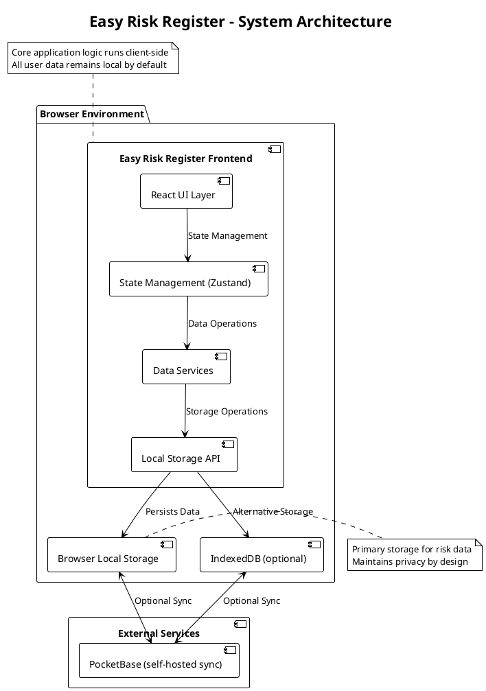
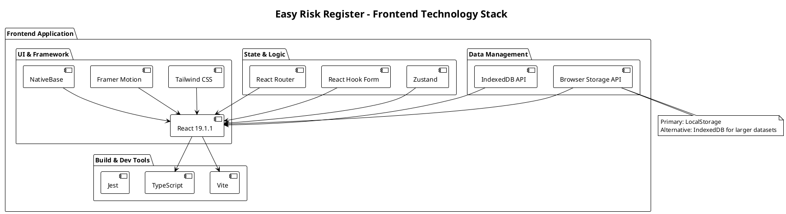
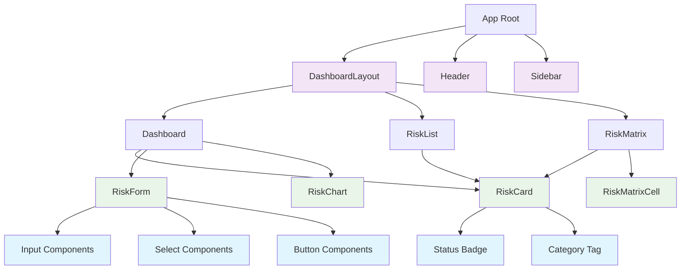
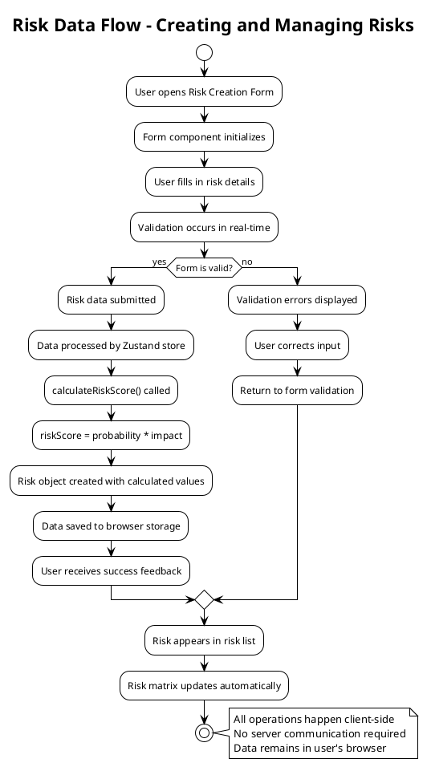
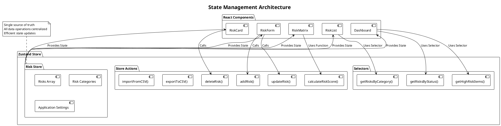
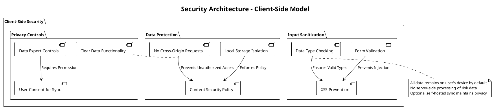
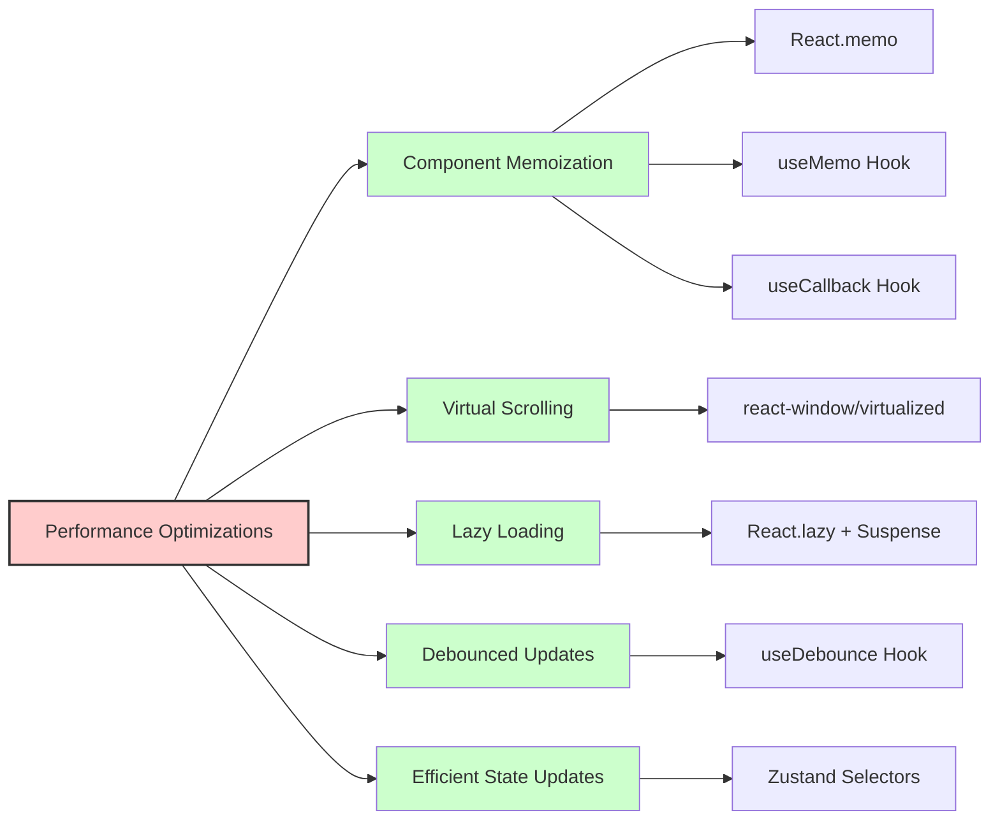
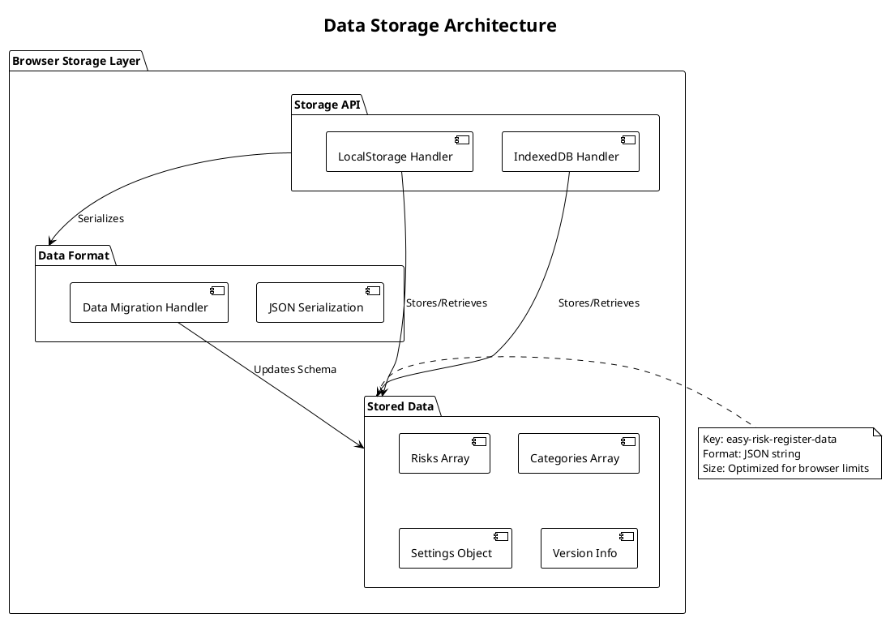

# System Architecture for Easy Risk Register

## Overview

Easy Risk Register is designed as a privacy-focused, client-side risk management application that operates entirely in the browser. The architecture emphasizes data privacy, performance, and usability while maintaining a clean separation of concerns for maintainability and future extensibility.

## Architecture Diagram

### High-Level System Architecture



## Technology Stack

### Frontend Architecture



## Component Architecture

### Core Component Structure



## Data Flow Architecture

### Risk Data Flow



## State Management Architecture

### Zustand Store Pattern



## Security Architecture

### Client-Side Security Model



## Performance Optimization

### Performance Architecture



## For Frontend Engineers

### Component Architecture

#### Core Component Structure
```
src/
├── components/
│   ├── ui/                 # Reusable UI components
│   │   ├── Button.tsx
│   │   ├── Input.tsx
│   │   ├── Modal.tsx
│   │   └── ...
│   ├── risk/              # Risk-specific components
│   │   ├── RiskForm.tsx
│   │   ├── RiskCard.tsx
│   │   ├── RiskMatrix.tsx
│   │   └── ...
│   ├── layout/            # Layout components
│   │   ├── Header.tsx
│   │   ├── Sidebar.tsx
│   │   └── DashboardLayout.tsx
│   └── common/            # Shared utility components
├── pages/                 # Page components
│   ├── Dashboard.tsx
│   ├── RiskList.tsx
│   ├── RiskCreate.tsx
│   └── Settings.tsx
├── hooks/                 # Custom React hooks
│   ├── useLocalStorage.ts
│   ├── useForm.ts
│   └── useRiskCalculations.ts
├── stores/                # Zustand stores
│   └── riskStore.ts
├── types/                 # TypeScript type definitions
│   └── index.ts
└── utils/                 # Utility functions
    ├── calculations.ts
    ├── exports.ts
    └── validators.ts
```

## Data Architecture Specifications

### Entity Design

#### Risk Entity
- **Entity Name**: Risk
- **Purpose**: Represents a single risk item with all necessary attributes for risk management
- **Attributes**:
  - `id` (string, UUID, required, primary key)
  - `title` (string, max 200 chars, required)
  - `description` (string, max 1000 chars, optional)
  - `probability` (number, 1-5 scale, required)
  - `impact` (number, 1-5 scale, required)
  - `riskScore` (number, calculated as probability × impact, required)
  - `category` (string, predefined options, required)
  - `status` (string, 'open'|'mitigated'|'closed', default: 'open')
  - `mitigationPlan` (string, max 2000 chars, optional)
  - `creationDate` (ISOString, required)
  - `lastModified` (ISOString, required)

### Data Storage Strategy

#### Local Storage Implementation



This architecture provides a solid foundation for implementing the Easy Risk Register application while maintaining the privacy-first, client-side approach as specified in the product requirements. The modular design allows for future extensibility, including optional server-side features like cloud sync while preserving the core privacy-focused model.