# Component Architecture - Risk Management Features

## Overview

This document details the component architecture for the risk management features in Easy Risk Register, showing how components interact and the data flow between them.

## Component Hierarchy


## Risk Card Component Architecture


## Risk Form Architecture


## Data Flow Architecture

### Risk Creation Flow

```plantuml
@startuml
!theme plain
title Risk Creation Data Flow

participant "RiskForm Component" as Form
participant "React Hook Form" as RHF
participant "Zustand Store" as Store
participant "Local Storage" as Storage
participant "UI Components" as UI

Form -> RHF: Submit form data
RHF -> Form: Validate data
alt Validation passes
  Form -> Store: addRisk(data)
  Store -> Store: calculateRiskScore()
  Store -> Store: updateState()
  Store -> Storage: persistData()
  Store -> UI: notifyRiskAdded()
  UI -> Form: Reset form
else Validation fails
  RHF -> Form: showErrors()
  Form -> Form: Highlight errors
end

note right of Store
  Risk score calculated as:
  riskScore = probability × impact
end note

@enduml
```



## Component State Management

### Zustand Store Pattern


## Responsive Component Architecture

### Layout Components Structure


## Form Validation Architecture

### Input Validation Flow

```mermaid
flowchart TD
    A[User Enters Data] --> B[Real-time Validation]
    B --> C{Field Valid?}
    C -->|Yes| D[Enable Submit Button]
    C -->|No| E[Show Error Message]
    D --> F[Accumulate Valid Fields]
    E --> A
    F --> G[Form Submit Enabled]
    G --> H[Final Validation]
    H --> I{All Fields Valid?}
    I -->|Yes| J[Submit Form]
    I -->|No| K[Scroll to First Error]
    J --> L[Process Data]
    K --> E

    style A fill:#e1f5fe
    style J fill:#e8f5e8
    style E fill:#ffebee
</flowchart>

## Risk Matrix Visualization Architecture

```plantuml
@startuml
!theme plain
title Risk Matrix Visualization Component

package "RiskMatrix Component" {
  
  package "Data Input" as Input {
    [Risk Data] as Risks
    [Filter Criteria] as Filters
    [Display Settings] as Settings
  }
  
  package "Calculation Layer" as Calc {
    [Position Calculator] as Position
    [Severity Classifier] as Severity
    [Category Grouping] as Grouping
  }
  
  package "Visualization Layer" as Viz {
    [Grid Renderer] as Grid
    [Risk Marker Renderer] as Markers
    [Label Renderer] as Labels
    [Interaction Handler] as Interaction
  }
  
  package "Output" as Output {
    [Interactive Matrix] as Matrix
    [Risk Details Panel] as Details
    [Selection Feedback] as Feedback
  }
}

Input --> Calc : Provides data
Calc --> Viz : Provides coordinates
Viz --> Output : Renders visualization
Output --> Input : Updates filters

note right of Output
  5x5 probability-impact grid
  Color-coded by severity
  Interactive risk selection
end note

@enduml
```

## Accessibility Architecture

### ARIA Implementation


## Performance Optimization Architecture

### Optimized Component Rendering


This component architecture documentation provides a detailed view of how the risk management features are structured, showing the relationships between components and the flow of data through the application.