# User Journey Documentation - Easy Risk Register

## Overview

This document outlines the primary user journeys and experiences for the Easy Risk Register application, including visual flow diagrams to illustrate the user interaction patterns.

## Primary User Journeys

### 1. First-Time User Journey


### 2. Regular Risk Management Journey

```plantuml
@startuml
!theme plain
title Regular Risk Management Workflow

start
:User accesses application;
if (Has existing risks?) then (yes)
  :Loads existing risks from storage;
  :Displays dashboard with stored data;
else (no)
  :Shows empty state with instructions;
endif

:User selects action;
if (Action is "Add Risk"?) then (yes)
  :Open risk creation form;
  :User fills risk details;
  :Validate input data;
  if (Data is valid?) then (yes)
    :Calculate risk score (probability × impact);
    :Save risk to storage;
    :Show success notification;
    :Update dashboard view;
  else (no)
    :Display validation errors;
    :User corrects data;
  endif
elseif (Action is "View Risks"?) then (yes)
  :Load and display risk list;
  :Show risk matrix visualization;
  :Display risk summary statistics;
elseif (Action is "Filter/Sort"?) then (yes)
  :Apply filters to risk display;
  :Update visualizations;
endif

:User interacts with existing risks;
if (User edits risk?) then
  :Open edit form with current values;
  :Update risk data on save;
  :Recalculate risk score if needed;
elseif (User deletes risk?) then
  :Confirm deletion with user;
  :Remove risk from storage;
  :Update all views;
endif

stop

note right
  All actions happen client-side
  Data persists in browser storage
  Risk score automatically calculated
end note

@enduml
```



## Detailed Feature Workflows

### Risk Creation Workflow

```mermaid
flowchart TD
    A[User clicks "Add New Risk"] --> B[Open Risk Creation Modal]
    B --> C[Display empty risk form]
    C --> D[User inputs risk details]
    D --> E[Real-time validation]
    E --> F{Form valid?}
    F -->|No| G[Show validation errors]
    G --> D
    F -->|Yes| H[Calculate risk score]
    H --> I[Save risk to store]
    I --> J[Update UI with new risk]
    J --> K[Close modal and show success message]
    K --> L[Risk appears in list and matrix]

    style A fill:#e1f5fe
    style L fill:#e8f5e8
    style F fill:#fff3e0
</flowchart>

## Risk Matrix Visualization Journey

```plantuml
@startuml
!theme plain
title Risk Matrix Interaction Flow

rectangle "Risk Matrix Visualization" as Matrix {
  rectangle "5x5 Grid" as Grid {
    rectangle "Low Risk Zone (1-3)" as Low
    rectangle "Medium Risk Zone (4-6)" as Medium  
    rectangle "High Risk Zone (7-25)" as High
  }
  
  rectangle "Risk Markers" as Markers
  rectangle "Category Filters" as Filters
  rectangle "Risk Details Popover" as Popover
}

Filters --> Grid : Filter by category
Markers --> Grid : Position by prob/impact
Popover --> Markers : Show on hover/click

note bottom of Matrix
  Interactive visualization
  Color-coded by severity
  Click to view/edit details
end note

@enduml
```

### Data Export Journey


## Accessibility Journey

### Screen Reader Experience


## Responsive Design Journey

### Multi-Device Experience


## Error Handling Journey

### Handling Data Issues


## Performance Journey

### Optimized User Experience


## User Personas Journey

### Target User Experience


This documentation provides a comprehensive view of user interactions with the Easy Risk Register application, showing how the application responds to different user needs and scenarios while maintaining the simplicity and privacy-focused approach of the product.