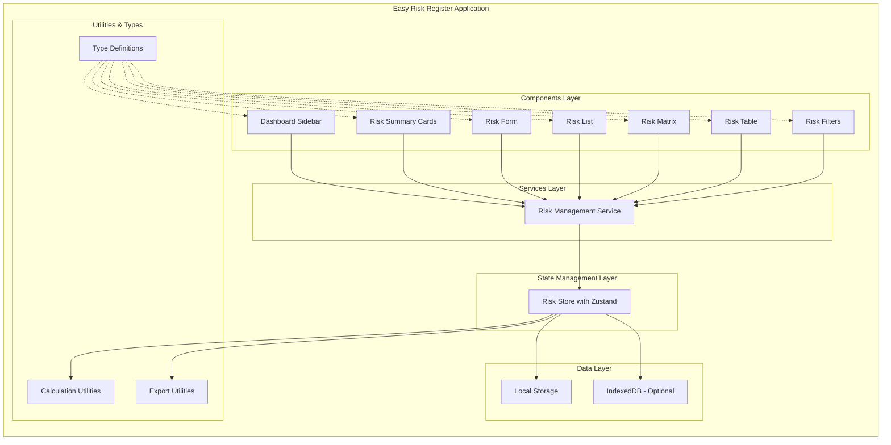
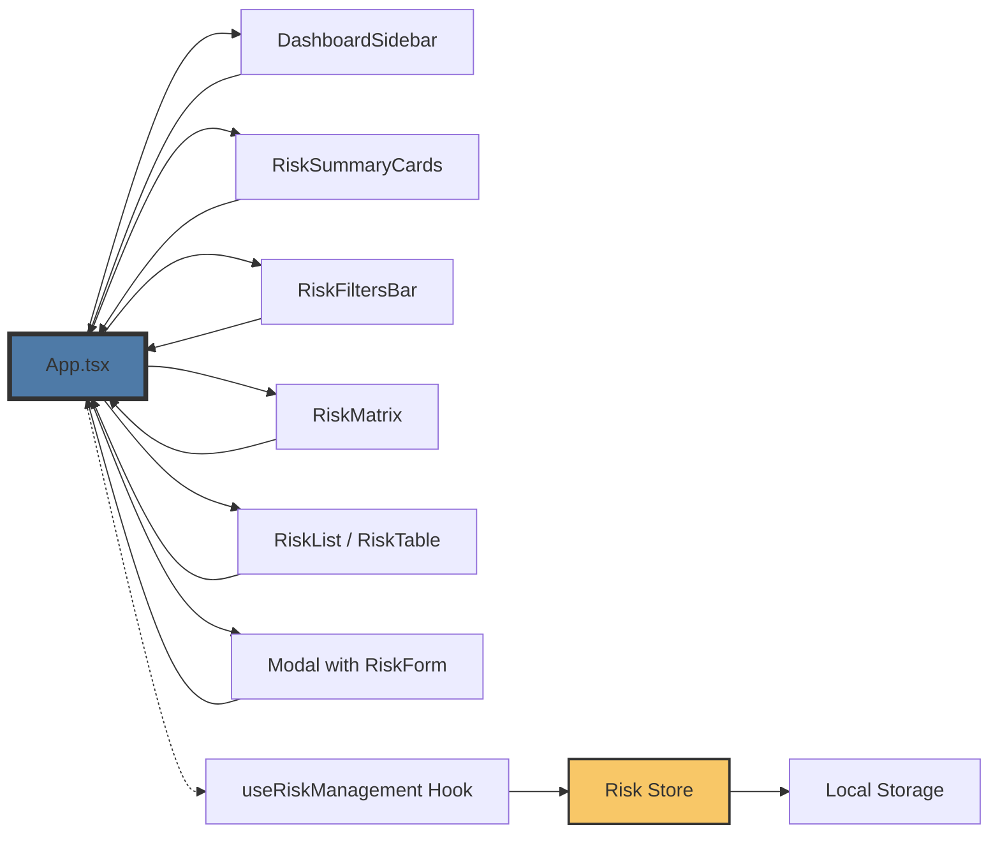
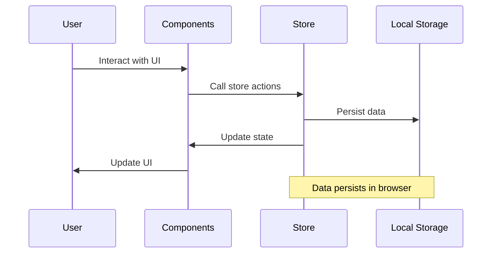
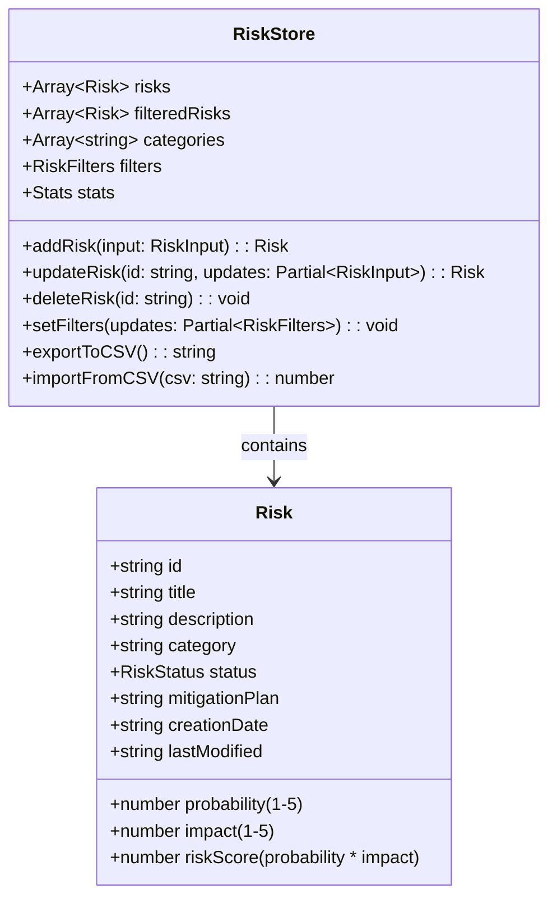
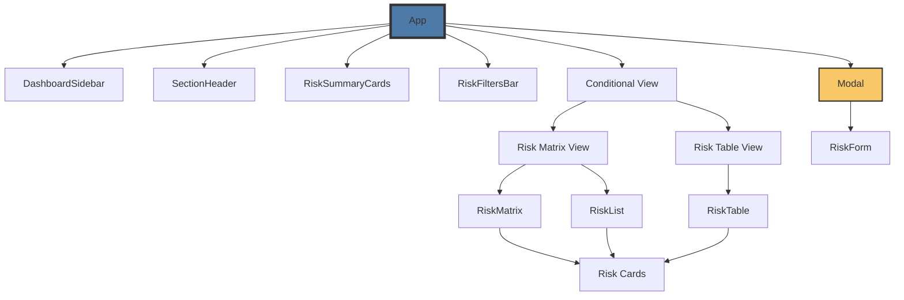
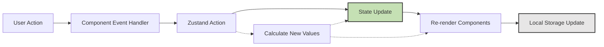

# Easy Risk Register - System Diagrams

This document contains Mermaid diagrams that visualize the architecture, data flow, and component relationships of the Easy Risk Register application.

## Architecture Diagram

## Component Flow Diagram

## Data Flow Diagram

## Zustand Store Structure

## Component Hierarchy

## State Management Flow

